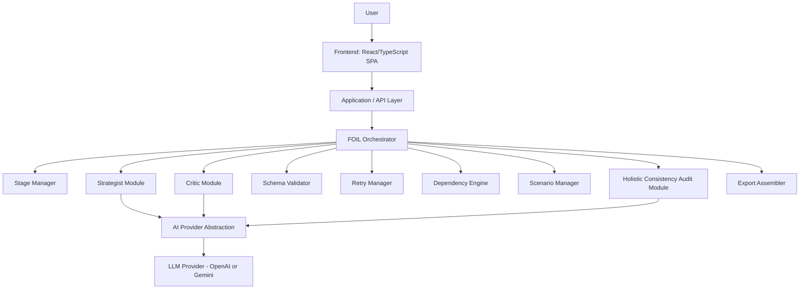

# FOIL Architecture

## Purpose

This document is the technical implementation blueprint for FOIL, the staged AI brand engine specified in `PRD.md`. The PRD defines **what** FOIL must do — every stage's inputs, output schema, Critic checks, approval states, dependencies, and failure handling. This document defines **how** those requirements are technically realized: components, data model, API contracts, state machines, and build order.

**Relationship between the two documents:** the PRD is the source of truth for product behavior. Where this document is silent or ambiguous, the PRD governs. Where a technical decision is genuinely unresolved by the PRD, it is marked `OPEN ARCHITECTURE DECISION` (Section 32) rather than invented. Nothing here changes, simplifies, or removes a PRD requirement.

## Architectural philosophy

FOIL is a **hackathon MVP**, not an enterprise product. The architecture is deliberately thin: one Strategist role, one Critic role (reused for the Holistic Consistency Audit), one shared context object, one stateless backend, no database, no auth, no multi-tenant infrastructure. All product depth comes from the *workflow* (adversarial critique at every stage, holistic cross-field audit, scenario branching), not from infrastructure complexity. This mirrors PRD Section 5's own claim: differentiation is architectural/workflow depth, not new infrastructure.

## Core system components

1. **Frontend (React/TypeScript SPA)** — owns the canonical Shared Context object for the active session, renders every stage's draft/critique/approval UI, drives the Scenario Probe comparison view, and triggers export.
2. **Backend API layer (stateless)** — one thin layer of endpoints, each of which: receives the relevant slice of Shared Context + a stage's input, calls the Strategist and/or Critic through the AI Provider Abstraction, schema-validates the result, and returns it. It holds no session state between requests.
3. **AI Provider Abstraction** — a single interface (`generateStructured`, `generateCritique`) implemented by an OpenAI adapter and a Gemini adapter, so the rest of the system never depends on a specific SDK.
4. **Schema Validator** — Zod schemas for every Strategist/Critic output, with a capped-retry loop.
5. **Dependency Engine** — pure function implementing the PRD Section 14 dependency map; used by both "edit an approved field" and Scenario Probe.
6. **Export Assembler** — pure function that assembles the Markdown kit from `approved_decisions`, gated on completeness.

## Major data flow

```
User
 -> Frontend (holds Shared Context)
 -> POST /api/stages/:stage/generate   (Strategist)
 -> POST /api/stages/:stage/critique   (Critic)
 -> Frontend renders draft + findings
 -> User: accept / reject / edit
 -> Frontend updates Shared Context locally
 -> (if approved) Dependency Engine flags downstream fields needs_review
 -> Next stage repeats
 -> Stage 8: POST /api/audit/holistic (Critic, whole-system input)
 -> Stage 9: POST /api/export (no AI; pure assembly)
```

The backend never stores Shared Context across requests. The frontend is the authoritative runtime owner and sends the required context slice with each API call. The client mirrors the current working context to sessionStorage for same-tab refresh recovery only. This is session-scoped resilience, not durable database persistence: closing the tab/session ends the working session. No server database, account system, or cross-session project persistence is in MVP scope.

## Major design principles

See Section 2 for the full numbered list. In summary: approved data is sacred and append-only via `revision_log`; AI output is never trusted unvalidated; every gate requires explicit human approval; nothing is silently regenerated; and the system stays small enough to build and demo within a hackathon window.

---

## 2. Architectural principles

1. **Approved decisions are authoritative.** Every downstream stage, the Consistency Audit, and Export read only from `approved_decisions`.
2. **AI output is never trusted without validation.** Every Strategist/Critic response passes schema validation before it can be shown as a result.
3. **User approval is required before downstream progression.** No stage's output feeds the next stage until its state reaches `approved`.
4. **AI assumptions must remain distinguishable from user facts.** `user_facts` and `ai_assumptions` are separate, separately-rendered fields; assumptions carry a rationale and are never silently promoted to facts.
5. **No silent mutation of approved decisions.** Only an explicit user action (accept a Critic finding, accept a Consistency Audit finding, accept a Scenario Probe branch, or a direct edit) may change `approved_decisions`, and each such action writes a `revision_log` entry.
6. **No blind regeneration.** The Dependency Engine flags only the fields the PRD's dependency map says are affected; everything else is left untouched.
7. **Dependencies determine affected fields.** Section 14 of the PRD is implemented literally as a lookup table, not inferred at runtime.
8. **Strategist and Critic have separate responsibilities.** The Strategist grounds drafts in approved upstream context; the Critic only attacks and proposes sharper alternatives. Neither role's prompt performs the other's job.
9. **Holistic Consistency Audit operates on the complete approved system.** It is one Critic call over the entire `approved_decisions` object, not N per-field calls.
10. **Failed AI operations must fail visibly.** No fabricated fallback content, ever, at any stage.
11. **No fabricated claims.** In particular, no trademark/domain availability claims anywhere in generated or exported content.
12. **Keep architecture simple enough for a hackathon MVP.** No database, no auth, no queues, no microservices, no containers, unless a concrete requirement forces it (none currently does).

---

## 3. High-level system architecture



Notes on this diagram vs. the PRD's conceptual structure:

- There is no separate "Approval Manager" backend component: approval-state transitions are driven by explicit user actions in the frontend and are recorded into the Shared Context the frontend holds. The backend validates that a request is legal given the state it's told (e.g., it will not run Tagline generation without an `approved` Positioning in the payload) but does not itself own a persisted state machine.
- `SM` (Stage Manager) is a thin routing layer: it dispatches a stage name to the correct Strategist/Critic prompt template and schema, nothing more.
- `AUDIT` reuses `CRIT` internally (same Critic module, different input shape and prompt) — this is the architectural expression of "no third agent" (PRD Section 10, Invariant 7).

---

## 4. Technology stack

| Technology | Version | Purpose | Why | Where used |
| --- | --- | --- | --- | --- |
| TypeScript | 5.x | Primary language, frontend and backend | Type safety across the Shared Context, Zod schemas, and API contracts reduces a whole class of "malformed AI output slipped through" bugs | Everywhere |
| React | 18.x | Frontend UI | Component model fits the stage-by-stage, draft/critique/approval UI naturally; team already comfortable with it for a time-boxed hackathon | `/frontend` |
| Vite | 5.x | Frontend build tool | Fast dev server, minimal config, no need for a full meta-framework since there is no server-rendering requirement | `/frontend` |
| Next.js is **not** used | — | — | Rejected: FOIL has no SEO/SSR requirement, and a plain Vite SPA + a small Node API is simpler to reason about for a stateless backend design | — |
| Tailwind CSS | 3.x | Styling | Fast to build the draft-vs-critique and original-vs-scenario comparison views without hand-rolled CSS | `/frontend` |
| Node.js | 20 LTS | Backend runtime | Same language as frontend (TypeScript); simplest stack for a hackathon team | `/backend` |
| Express | 4.x | API layer | Minimal routing library; the API surface is small (Section 20) and doesn't need a heavier framework | `/backend` |
| Zod | 3.x | Schema validation | Validates every Strategist/Critic/Audit JSON response against the PRD's exact output-field lists before it is trusted | `/backend/schemas`, shared with `/frontend` for type inference |
| OpenAI SDK / Google Gen AI SDK | latest | LLM calls | Both are supported behind one interface; PRD Section 27 leaves the final provider choice as a team decision | `/backend/ai/providers` |
| Zustand | 4.x | Frontend state management | Holds the Shared Context object in memory; simpler than Redux for a single-session, single-project app | `/frontend/store` |
| React Router | 6.x | Client routing between stages | Lets each stage be a distinct, linkable view during the demo | `/frontend` |
| Vitest / Jest | latest | Testing | Unit + integration tests (Section 25) | root, both packages |
| Playwright | latest | End-to-end test | Drives the Section 25 fixture-idea test through the full pipeline in a real browser | `/e2e` |
| Vercel or Render (single deploy) | — | Deployment | One frontend + one backend service, no orchestration needed | — |

Server database/durable persistence: **none**. Client-side sessionStorage is permitted solely to restore the active working context after a same-tab refresh; it must not be represented as durable or cross-session storage.

---

## 5. Repository structure

```
/
├── architecture.md
├── README.md
├── .env.example
├── package.json                # workspace root (npm/pnpm workspaces)
├── frontend/
│   ├── src/
│   │   ├── stages/             # one folder per stage: Discovery, Positioning, ...
│   │   │   ├── discovery/
│   │   │   ├── positioning/
│   │   │   ├── naming-personality/
│   │   │   ├── tagline-pitch/
│   │   │   ├── visual-brief/
│   │   │   ├── voice-messaging/
│   │   │   ├── launch-prep/
│   │   │   ├── consistency-audit/
│   │   │   └── kit-export/
│   │   ├── scenario-probe/     # what-if input, branch compare view
│   │   ├── components/         # shared UI: DraftCard, CriticFindingCard, ApprovalBar, DiffView
│   │   ├── store/               # Zustand store holding SharedContext + dispatch actions
│   │   ├── lib/
│   │   │   ├── dependency-map.ts        # imported from /shared, re-exported for FE use
│   │   │   └── api-client.ts            # typed fetch wrappers to backend endpoints
│   │   └── App.tsx
│   └── vite.config.ts
├── backend/
│   ├── src/
│   │   ├── routes/              # one file per endpoint group (Section 20)
│   │   ├── ai/
│   │   │   ├── provider.ts      # AIProvider interface
│   │   │   ├── providers/openai.ts
│   │   │   └── providers/gemini.ts
│   │   ├── strategist/          # one prompt-builder per stage
│   │   ├── critic/              # per-stage critic prompt-builders + the holistic audit prompt-builder
│   │   ├── validation/          # retry loop wrapping Zod parse
│   │   └── export/              # Markdown assembler
│   └── server.ts
├── shared/
│   ├── schemas/                 # Zod schemas, one file per stage output + Critic finding + Consistency finding
│   ├── types/                   # TypeScript interfaces: SharedContext, domain objects (Section 6)
│   └── dependency-map.ts        # single source of truth for Section 14's table
├── e2e/
│   └── fixture-idea.spec.ts     # Section 25's deliberately-flawed sample idea
└── docs/
    └── traceability-matrix.md   # generated copy of Section 31, kept alongside code
```

Responsibilities:

- `frontend/src/stages/*` — one directory per PRD stage; each owns its draft view, its Critic-finding view, and its approval controls. **Must not** contain business logic for dependency propagation or schema validation — that lives in `shared/`.
- `backend/src/routes/*` — thin HTTP handlers only: parse request, call the right Strategist/Critic module, validate, respond. **Must not** contain prompt text inline — prompts live in `strategist/` and `critic/`.
- `shared/` — the one place both frontend and backend import from, so the Shared Context type, the Zod schemas, and the dependency map cannot drift between the two sides.
- No `database/`, `migrations/`, or `models/` directory — there is no persistence layer (Section 7).

---

## 6. Domain model

All interfaces below are TypeScript, living in `shared/types/`.

```typescript
interface Project {
  project_id: string;               // uuid, generated client-side at session start
  created_at: string;               // ISO timestamp
  context: SharedContext;           // Section 11's object, in full
}

type StageName =
  | "discovery" | "positioning" | "naming_personality" | "tagline_pitch"
  | "visual_brief" | "voice_messaging" | "launch_prep"
  | "consistency_audit" | "kit_export";

type ApprovalState =
  | "draft" | "critic_review" | "needs_revision" | "needs_review"
  | "approved" | "rejected" | "failed";

interface StageDraft {
  stage: StageName;
  content: Record<string, unknown>;  // shape defined by that stage's Zod schema
  generated_at: string;
  attempt: number;                   // 1-based; caps at 2 automatic retries (Section 14 of PRD)
}

interface ApprovedDecision {
  stage: StageName;
  content: Record<string, unknown>;  // the approved shape for that stage
  approved_at: string;
  state: ApprovalState;              // always "approved" while stored here; kept for audit clarity
  source: "strategist_approved" | "user_edit" | "consistency_finding" | "scenario_accept";
}

interface CriticFinding {
  id: string;
  stage: StageName;
  target_field: string;
  issue_type: "cliche" | "audience_mismatch" | "contradiction" | "vague" | "bias";
  evidence: string;
  explanation: string;
  sharper_alternative: string;       // required; a finding without one is invalid (PRD Section 13)
  user_action: "accept" | "reject" | "edit" | null; // null until the user acts
}

interface ScenarioOverride {
  id: string;
  triggered_from_stage: StageName;   // the approved stage being reopened
  what_if_input: string;
  affected_fields: StageName[];      // computed by the Dependency Engine, Section 16
  branch_drafts: StageDraft[];       // Strategist+Critic re-runs for affected fields only
  decision: "keep_original" | "accept_branch" | "edit" | null;
  created_at: string;
}

interface RevisionLogEntry {
  id: string;
  changed_field: string;
  previous_value: unknown;
  new_value: unknown;
  cause: "user_edit" | "consistency_finding_accept" | "scenario_accept";
  cause_id: string;                  // finding id or scenario id
  timestamp: string;
}

interface ConsistencyFinding {
  id: string;
  fields_in_conflict: string[];
  issue_type: "cliche" | "audience_mismatch" | "contradiction" | "vague" | "bias";
  evidence: string;
  why_it_matters: string;
  sharper_alternative: string;
  user_action: "accept" | "reject" | "edit" | null;
}

interface ExportBundle {
  generated_at: string;
  format: "markdown" | "pdf";
  content: string;                   // fully assembled Markdown (Section 17)
  status: "exported" | "failed";
  failure_reason?: string;           // populated only when status === "failed"
}
```

Ownership and lifecycle notes:

- `StageDraft` is transient: overwritten on every regeneration attempt, never persisted past the session, never read by any stage other than the one that produced it (until approved, at which point its content is copied into an `ApprovedDecision`).
- `ApprovedDecision` is append/replace-only through explicit user action; every replace produces a `RevisionLogEntry`.
- `ScenarioOverride.branch_drafts` never writes to `approved_decisions` directly; only `decision: "accept_branch"` triggers a write, which itself is logged.
- `ConsistencyFinding` follows the same accept/reject/edit contract as `CriticFinding` but with a `fields_in_conflict` array instead of a single `target_field`, because Holistic Consistency Audit findings are inherently cross-field (PRD Section 16).

---

## 7. Shared context model

Implemented exactly as PRD Section 11 specifies:

```typescript
interface SharedContext {
  project_id: string;
  user_facts: Record<string, unknown>;
  ai_assumptions: Record<string, { value: unknown; rationale: string }>;
  approved_decisions: Partial<Record<StageName, ApprovedDecision>>;
  stage_drafts: Partial<Record<StageName, StageDraft>>;
  critic_findings: CriticFinding[];
  scenario_overrides: ScenarioOverride[];
  revision_log: RevisionLogEntry[];
}
```

- **`user_facts`** — populated only from fields the user directly typed or explicitly confirmed (e.g., promoting an `ai_assumption` to a fact via an explicit "confirm" action). Never written by a Strategist or Critic call directly.
- **`ai_assumptions`** — every Strategist-inferred field the user has not confirmed; always carries a `rationale`. Rendered in the UI visually distinct from `user_facts` (Section 21, frontend architecture).
- **`approved_decisions`** — the single source of truth every downstream Strategist prompt reads from. No other part of the system may write here except through the enforcement point described below.
- **`stage_drafts`** — working memory only; a stage's entry here is deleted (or superseded) once its content is approved and copied into `approved_decisions`.
- **`critic_findings`** — accumulates per-stage findings; each retains its `user_action` so demo/audit can show what was flagged and how it was resolved.
- **`scenario_overrides`** — stored separately from `approved_decisions` by construction (it is a different top-level array); nothing in the Dependency Engine or the Strategist ever reads `scenario_overrides` as if it were approved.
- **`revision_log`** — append-only; every write to `approved_decisions` must be paired with exactly one new entry here in the same client-side transaction (see enforcement below).

### `approved_decisions` invariant — enforcement, not just documentation

This is enforced at the code level via a single choke point, not by convention:

```typescript
// shared/store/approveDecision.ts
function writeApprovedDecision(
  ctx: SharedContext,
  stage: StageName,
  content: Record<string, unknown>,
  cause: RevisionLogEntry["cause"],
  causeId: string
): SharedContext {
  const previous = ctx.approved_decisions[stage]?.content ?? null;
  const revisionEntry: RevisionLogEntry = {
    id: uuid(),
    changed_field: stage,
    previous_value: previous,
    new_value: content,
    cause,
    cause_id: causeId,
    timestamp: new Date().toISOString(),
  };
  return {
    ...ctx,
    approved_decisions: {
      ...ctx.approved_decisions,
      [stage]: { stage, content, approved_at: revisionEntry.timestamp, state: "approved", source: cause === "user_edit" ? "user_edit" : cause === "scenario_accept" ? "scenario_accept" : "consistency_finding" },
    },
    revision_log: [...ctx.revision_log, revisionEntry],
  };
}
```

**No other function in the codebase is permitted to assign into `ctx.approved_decisions` directly.** This is enforced by code review convention plus a lint rule (`no-restricted-syntax` forbidding direct property assignment into `approved_decisions` outside `shared/store/approveDecision.ts`) and by a unit test (Section 25) that asserts every path that changes `approved_decisions` also appends exactly one `revision_log` entry.

---

## 8. Stage architecture

Every generative stage (1–7) follows one common contract:

```
Input Context (approved_decisions slice)
        |
        v
   Strategist            <- StageInput
        |
        v
Schema Validation (Zod)  <- retry up to 2x on failure
        |
        v
     Critic               <- StageOutput (as draft)
        |
        v
Schema Validation (Zod)
        |
        v
  Critic Findings          <- CriticFinding[]
        |
        v
   User Review
        |
        v
Approval / Revision        <- writeApprovedDecision()
        |
        v
  Approved Decision
```

```typescript
interface StageDefinition<TInput, TOutput> {
  stage: StageName;
  requiredApprovedStages: StageName[];        // e.g. positioning requires ["discovery"]
  buildStrategistPrompt: (input: TInput) => string;
  outputSchema: ZodSchema<TOutput>;
  buildCriticPrompt: (draft: TOutput, input: TInput) => string;
  criticFindingSchema: ZodSchema<CriticFinding[]>;
  maxAutoRetries: 2;
}

interface StageInput {
  approved_decisions: Partial<Record<StageName, ApprovedDecision>>; // only the stages this stage depends on
  scenario_override?: ScenarioOverride;        // present only when invoked from the Scenario Probe
}

interface StageOutput {
  stage: StageName;
  content: Record<string, unknown>;            // validated against outputSchema
}

interface CriticOutput {
  findings: CriticFinding[];                   // may be empty -> auto-approved
}

interface ApprovalAction {
  stage: StageName;
  action: "approve" | "edit" | "reject_and_regenerate";
  edited_content?: Record<string, unknown>;    // present only when action === "edit"
}
```

Every stage's backend route is a thin instantiation of this same `StageDefinition<TInput, TOutput>` generic, differing only in prompt builders and schema — this is what keeps 9 stages from becoming 9 bespoke implementations.

---

## 9. All FOIL stages — technical contracts

Each stage below maps its PRD table (Section 9.x of the PRD) onto the `StageDefinition` shape from Section 8.

### Stage 1 — Discovery
- `requiredApprovedStages`: none (first stage; reads only raw idea text).
- **Zod schema** (`DiscoverySchema`): `core_problem: string`, `target_audience: string`, `context_situation: string`, `user_goals: string`, `constraints: string`, `value_desired_outcome: string`, `open_questions: string[]`, `known_facts: string[]`, `inferred_assumptions: { value: string; rationale: string }[]`.
- **Critic issue types allowed**: `vague`, `audience_mismatch`.
- **Client-side guard**: idea text length (1–500 words) is validated before any network call; empty/short input never reaches the backend.

### Stage 2 — Positioning
- `requiredApprovedStages`: `["discovery"]`.
- **Zod schema** (`PositioningSchema`): `directions: PositioningDirection[]` (min length 2), each with `title, category, target_audience, core_problem, differentiator, value_proposition, competitive_angle, strategic_rationale, potential_weakness`.
- **Critic behavior**: runs once per direction, **plus** one divergence check comparing the two directions; if the divergence check fails, the Retry Manager (Section 14) triggers up to 2 automatic regenerations before surfacing a manual-retry prompt.
- **User interaction**: selecting one direction writes it to `approved_decisions.positioning`; the rejected direction is written to a `rejected_directions` array inside the same approved record (not deleted) for audit/demo purposes.

### Stage 3 — Naming + Personality
- `requiredApprovedStages`: `["positioning"]`.
- **Zod schema** (`NamingPersonalitySchema`): `naming_directions: NamingDirection[]` (each with `territory, proposed_name, rationale, relationship_to_audience, relationship_to_positioning, potential_concern, critic_analysis, sharper_alternative`), `personality_traits: Trait[]` (length 3–5, each with an audience justification field), `traits_to_avoid: string[]`, `brand_principles: { principle: string; rationale: string }[]`.
- **Hard constraint enforced in the prompt template and again by a post-processing string check**: no trademark/domain availability language (e.g. "is available", "not taken", ".com is free") may appear anywhere in Strategist or Critic output for this stage; any match fails validation and forces a regeneration rather than being shown to the user.

### Stage 4 — Tagline & One-line Pitch
- `requiredApprovedStages`: `["naming_personality"]`.
- **Zod schema**: `tagline_options: string[]`, `one_line_pitch: string`, `rationale_per_tagline: string[]`, aligned by index.
- **Critic behavior**: interchangeability test — for each tagline option, the Critic explicitly answers "could this apply unchanged to a generic competitor?"; any option answered "yes" is marked invalid and excluded from what the user can approve without a flagged finding.

### Stage 5 — Visual Brief
- `requiredApprovedStages`: `["positioning", "naming_personality"]`.
- **Zod schema**: `logo_direction, color_mood, hex_palette: string[] (valid hex), type_roles: string[], shape_language, symbol_language, composition_layout, imagery_direction, concepts_to_avoid: string[], rationale_linking_to_audience_and_positioning`.
- **UI requirement enforced at the component level**: every render of this stage's output is wrapped in a labeled banner reading "AI-generated visual concept / design direction" — this string lives in one shared component (`<VisualConceptBanner/>`) so it cannot be omitted by a future stage variant.
- **Image generation**: out of MVP scope (PRD Section 7); if implemented later as a stretch item, it is a job-status-polling call with a fallback to the typographic/palette brief on failure — no blocking call, no fabricated image.

### Stage 6 — Voice & Messaging
- `requiredApprovedStages`: `["naming_personality"]`.
- **Zod schema**: `voice_description, tone_characteristics: string[], do_list: string[], dont_list: string[], sample_messages: { message: string; explanation: string }[]` (length 3–4).
- **Critic behavior**: checks each sample message against approved personality traits; a message that fails Critic review twice is dropped from the set and flagged in the UI, never silently kept (PRD failure handling for this stage).

### Stage 7 — Launch Prep
- `requiredApprovedStages`: `["naming_personality", "voice_messaging", "positioning"]` (personality, voice, positioning, and audience per PRD).
- **Zod schema**: `landing_headline: string`, `social_launch_post: string`.
- **Downstream note**: this stage's approved output is a **required input** to Stage 8 — the Consistency Audit route will refuse to run if `approved_decisions.launch_prep` is absent (see enforcement in Section 18, "Architectural Invariants").

### Stage 8 — Holistic Consistency Audit
- `requiredApprovedStages`: all of `discovery, positioning, naming_personality, tagline_pitch, visual_brief, voice_messaging, launch_prep`.
- **Input shape**: the entire `approved_decisions` object serialized as one payload — not iterated per field.
- **Zod schema** (`ConsistencyFindingSchema[]`): matches `ConsistencyFinding` from Section 6.
- **Minimum checks** (implemented as one prompt instructing the Critic to check all of the following before returning findings): positioning↔personality, name↔positioning, name↔personality, tagline↔positioning, tagline↔personality, visuals↔audience, visuals↔personality, voice↔personality, sample_messages↔voice, launch_headline↔brand, launch_social_post↔brand, whole-system coherence.
- **Approval state for this stage** is its own sub-machine (see Section 18) rather than the generic 8-state model, because resolution is per-finding, not per-field: `pending -> findings_ready -> user_reviewing -> resolved`.

### Stage 9 — Kit Assembly & Export
- `requiredApprovedStages`: everything, **and** every `ConsistencyFinding.user_action` must be non-null.
- **No AI call.** Pure assembly function reading only `approved_decisions` plus the resolved `ConsistencyFinding[]` history.
- **Zod schema**: `ExportBundle` (Section 6).
- **Failure mode**: if any required stage is missing from `approved_decisions`, or any `ConsistencyFinding.user_action` is still `null`, the assembler returns `{ status: "failed", failure_reason: "<specific stage or finding id>" }`. The API layer surfaces this as a 422 with the same message — never a partial file, never a 200 with placeholder content.

---

## 10. Strategist architecture

**Responsibilities**: produce a schema-shaped draft for exactly one stage, grounded only in the `approved_decisions` slice it is given.

**Input format**: `StageInput` (Section 8) — the relevant subset of `approved_decisions`, plus (for Scenario Probe re-runs) a `scenario_override` describing the what-if.

**Context filtering**: each stage's `StageDefinition.requiredApprovedStages` list is used to slice `approved_decisions` down to only what that stage is allowed to see, both for prompt-construction efficiency and to enforce that (e.g.) the Naming Strategist cannot accidentally read Launch Prep content that doesn't exist yet.

**Output schema**: the stage's Zod schema (Section 9); the Strategist function returns raw provider text, which is parsed and validated before anything downstream sees it.

**Validation**: handled by the shared Schema Validator (Section 13), not by the Strategist module itself — the Strategist module's job stops at "produced a completion."

**Error behavior**: on a provider error (timeout, rate limit) the Strategist function throws a typed `AIProviderError`; the route catches it and returns the Section 18-defined "AI service is temporarily unavailable" response with retry-with-backoff metadata. On a schema-validation failure, the Retry Manager (Section 14) re-invokes the Strategist with an appended "your previous output did not match the required schema; the specific error was: `<zod error>`" instruction, up to 2 times.

**Hard rule**: the Strategist prompt template for every stage explicitly instructs the model to treat unconfirmed information as `inferred_assumptions` rather than asserting it as fact — this is a prompt-level implementation of PRD Section 10's "never invents facts the user hasn't confirmed."

---

## 11. Critic architecture

**Responsibilities**: given a Strategist draft (or, for Stage 8, the whole approved system), attack it for the PRD's five issue types and — for every finding — propose a `sharper_alternative`.

**Supported issue types**: `cliche | audience_mismatch | contradiction | vague | bias` (exactly the PRD Section 13 enum; `bias` is not optional, it is a first-class type from v4.0 onward).

**Finding requirements enforced by schema, not just prompt instruction**: `CriticFindingSchema` in Zod marks `sharper_alternative` as a required non-empty string. If a raw provider response includes a finding with an empty or missing `sharper_alternative`, Zod validation fails for the whole findings array (not silently drops that one finding), and the Retry Manager treats it exactly like any other schema failure — up to 2 retries, then a visible error. This is the code-level enforcement of PRD Section 13's "a finding with no sharper_alternative is not valid Critic output."

**Reuse for the Holistic Consistency Audit**: the Critic module exposes two entry points sharing the same underlying provider-call and retry machinery:
```typescript
interface CriticModule {
  critiqueStage(stage: StageName, draft: StageOutput, input: StageInput): Promise<CriticFinding[]>;
  auditWholeSystem(approvedDecisions: SharedContext["approved_decisions"]): Promise<ConsistencyFinding[]>;
}
```
`auditWholeSystem` is a different prompt template and a different (wider) output schema, but the same provider adapter, the same retry cap, and the same "no valid finding without a sharper_alternative" rule. This is the literal implementation of PRD Section 10's "architecturally the same mechanism, applied wider, not a third agent."

---

## 12. AI provider abstraction

```typescript
interface AIProvider {
  generateStructured<T>(prompt: string, schema: ZodSchema<T>): Promise<{ raw: string; parsed: T | null; validationError?: string }>;
  generateCritique(prompt: string, schema: ZodSchema<CriticFinding[]>): Promise<{ raw: string; parsed: CriticFinding[] | null; validationError?: string }>;
}
```

Two adapters implement this interface: `backend/src/ai/providers/openai.ts` and `backend/src/ai/providers/gemini.ts`. A single environment variable, `AI_PROVIDER`, selects which adapter the app wires up at startup (`OPENAI` or `GEMINI`); no other module references either SDK directly. Business logic (Strategist, Critic, Retry Manager) depends only on the `AIProvider` interface, never on a provider-specific type or SDK call.

`generateStructured` and `generateCritique` both return the raw text alongside the parse result, specifically so the Retry Manager can log what the model actually returned when a validation failure occurs (Section 15, Observability), without needing to re-fetch it.

---

## 13. Schema validation

```
LLM
 |
 v
Raw response text
 |
 v
Parser (extract JSON — handles fenced code blocks, stray prose)
 |
 v
Zod schema.safeParse()
 |
 +-- success --> continue (draft/findings usable downstream)
 |
 +-- failure --> Retry Manager: re-invoke with the Zod error appended to the prompt
                 |
                 +-- succeeds within 2 retries --> continue
                 |
                 +-- still failing after 2 retries --> visible failure (Section 14)
```

Schemas live in `shared/schemas/`, one file per stage output, one for `CriticFinding[]`, one for `ConsistencyFinding[]`, one for `ExportBundle`. Both frontend and backend import from the same files (frontend for `z.infer<>` types used in components; backend for `safeParse`), so the two sides cannot silently drift apart on what a "valid Discovery record" looks like.

Errors are returned to the frontend as:
```typescript
interface StageErrorResponse {
  stage: StageName;
  error_type: "schema_validation_failed" | "provider_unavailable" | "rate_limited";
  message: string;          // human-readable, matches Section 18's "User sees" column
  retryable: boolean;
}
```

---

## 14. Retry and failure policy

Implemented as a single `RetryManager` used by both the Strategist path and the Critic path:

- **Malformed structured output**: maximum 2 automatic retries per call, each retry appending the specific Zod error to the prompt; on the 3rd failure, return `StageErrorResponse` with `error_type: "schema_validation_failed"`.
- **Automatic regeneration attempts per field** (e.g., Positioning's divergence check, Tagline's interchangeability check): capped at 2, exactly matching the retry cap above — the same `RetryManager` instance is reused rather than a second counter, to avoid two independently-tunable limits drifting apart.
- **Explicit user retry** after automatic attempts are exhausted is always available via a "Try again" action in the UI; this resets the attempt counter for that specific stage/field only.
- **AI provider failure** (network error, 5xx): caught at the `AIProvider` adapter boundary, surfaced as `error_type: "provider_unavailable"`, `retryable: true`.
- **Rate limiting**: adapter maps provider-specific rate-limit responses (e.g., HTTP 429) to `error_type: "rate_limited"`, with a `retry_after_seconds` hint passed through when the provider supplies one.
- **Timeout**: each provider call has a client-side timeout (default 30s, configurable via `AI_REQUEST_TIMEOUT_MS`); a timeout is treated identically to `provider_unavailable`.
- **Never fabricate fallback content.** There is no code path in the Strategist, Critic, or Audit modules that returns synthesized "looks plausible" content when the provider fails — every failure path returns a `StageErrorResponse`, and the frontend's only valid renderings for that state are the error UI or a retry button.

---

## 15. Approval state machine

```
draft
  -> critic_review
       -> needs_revision   (Critic flagged one or more findings)
       -> approved          (Critic found nothing to flag)
needs_revision
  -> draft                  (user requests regeneration, cycle repeats, capped by Section 14)
  -> approved                (user accepts despite findings, e.g. accepts Critic's sharper_alternative directly)
approved
  -> needs_review            (triggered by: an upstream field edit, OR an accepted Scenario Probe branch)
needs_review
  -> critic_review           (re-run Critic against the now-possibly-stale field)
       -> approved
       -> needs_revision
any state
  -> failed                  (schema validation failure after 2 retries; always surfaced to the user, never hidden)
```

**`needs_revision` vs. `needs_review` — the distinction is load-bearing, not cosmetic:**

- `needs_revision`: the Critic looked at the *current* draft for *this* stage and found a problem in it. The fix is: regenerate or edit *this* stage's content.
- `needs_review`: this stage was already `approved`, but an *upstream* stage changed (an edit, or an accepted Scenario Probe branch), and the Dependency Engine (Section 16) flagged this stage as potentially stale. The fix is: the user re-confirms (or updates) *this* stage in light of the upstream change — the system never silently regenerates it without that confirmation.

The state machine is implemented as a small pure function `transition(current: ApprovalState, event: ApprovalEvent): ApprovalState` in `shared/store/`, unit-tested exhaustively against every transition listed above (Section 25).

---

## 16. Dependency engine

Single source of truth, `shared/dependency-map.ts`:

```typescript
const DEPENDENCY_MAP: Record<StageName, StageName[]> = {
  discovery:          ["positioning", "naming_personality", "visual_brief", "voice_messaging", "launch_prep"],
  positioning:        ["naming_personality", "tagline_pitch", "visual_brief", "voice_messaging", "launch_prep", "consistency_audit"],
  naming_personality: ["tagline_pitch", "visual_brief", "voice_messaging", "launch_prep", "consistency_audit"],
  // "Name changes" in the PRD table is a sub-case of naming_personality; tagline/one-line-pitch/launch/audit
  // are already covered by the naming_personality row above, so no separate "name" row is needed.
  tagline_pitch:      ["launch_prep", "consistency_audit"],
  visual_brief:       ["consistency_audit"],
  voice_messaging:    ["launch_prep", "consistency_audit"],
  launch_prep:        ["consistency_audit"],
  consistency_audit:  [],
  kit_export:         [],
};

function affectedFields(changedStage: StageName): StageName[] {
  return DEPENDENCY_MAP[changedStage] ?? [];
}
```

This function is called from exactly two places: (1) the "edit an approved field" action handler, and (2) the Scenario Probe's what-if handler (Section 17). In both cases its output is used only to set the affected stages' `ApprovalState` to `needs_review` — **never** to trigger automatic regeneration. Regeneration for a `needs_review` stage only happens after the user explicitly opts in from that stage's UI, at which point it goes through the normal `critic_review` cycle like any other regeneration.

Fields not returned by `affectedFields()` are left completely untouched — no re-render with new content, no state change, no revision_log entry — matching the PRD's "approved content is never regenerated without a reason traceable to this map."

---

## 17. Scenario Probe

```
Approved Context (approved_decisions)
        |
        v
Scenario Input (what-if text, from any approved stage 1-8)
        |
        v
ScenarioOverride created (id, triggered_from_stage, what_if_input)
        |
        v
Dependency Engine: affectedFields(triggered_from_stage)
        |
        v
For each affected field: Strategist (with scenario_override in StageInput) -> Critic
        |
        v
Scenario Branch drafts stored in ScenarioOverride.branch_drafts
        |
        v
Frontend renders Original (approved_decisions[field]) vs. Branch (branch_drafts[field]) side by side
        |
        v
User decision per affected field: Keep Original | Accept Branch | Edit
        |
        +-- Keep Original --> no change; ScenarioOverride.decision recorded, approved_decisions untouched
        |
        +-- Accept Branch --> writeApprovedDecision(..., cause: "scenario_accept", causeId: scenario.id)
        |                      -> revision_log entry created
        |
        +-- Edit --> user-edited content passed to writeApprovedDecision(..., cause: "scenario_accept")
```

**Enforcement that scenario branches cannot silently mutate approved decisions**: `branch_drafts` is a field on `ScenarioOverride`, a top-level array in `SharedContext` that is structurally separate from `approved_decisions`. There is no function in the codebase that reads `scenario_overrides` and writes `approved_decisions` except the "Accept Branch" / "Edit" action handlers described above, both of which route through the single `writeApprovedDecision` choke point from Section 7 — so every accepted scenario change is, by construction, also a `revision_log` entry.

The Scenario Probe re-runs **only** `affectedFields(triggered_from_stage)` through Strategist+Critic — it is not a full-pipeline re-run, matching PRD Section 6's "re-runs only affected fields."

---

## 18. Holistic Consistency Audit architecture

**Execution**: triggered once, only after `approved_decisions.launch_prep` exists (enforced — the route returns a 409 with a message naming Launch Prep if it does not). It is a single call: `CriticModule.auditWholeSystem(approved_decisions)`.

**Input snapshot**: the entire `approved_decisions` object, serialized as-is — `name` (from `naming_personality`), `positioning`, `personality/principles` (from `naming_personality`), `tagline`, `one_line_pitch` (from `tagline_pitch`), `visual_brief`, `voice` (from `voice_messaging`), `sample_messages` (from `voice_messaging`), `launch_headline`, `launch_social_post` (from `launch_prep`). No field is read in isolation by a separate call — this is a single prompt with the entire object in its context.

**Validation**: the response is validated as `ConsistencyFinding[]` (Section 6); an empty array is valid (system judged fully consistent).

**Finding resolution** — its own sub-state-machine, distinct from the generic 8-state model in Section 15 because resolution is per-finding:
```
pending -> findings_ready -> user_reviewing -> resolved
```
- `pending`: audit call in flight.
- `findings_ready`: validated `ConsistencyFinding[]` received (possibly empty).
- `user_reviewing`: user is working through the list; each finding independently gets `user_action: accept | reject | edit`.
- `resolved`: **every** finding in the list has a non-null `user_action`. Not "at least one" — all of them.

**Accepted finding behavior**: for each field in `fields_in_conflict`, the relevant `approved_decisions` entry is updated via `writeApprovedDecision(..., cause: "consistency_finding_accept", causeId: finding.id)`.

**Rejected finding behavior**: no write to `approved_decisions`; the finding's `user_action: "reject"` is retained in `critic_findings` (or a dedicated `consistency_findings` array) purely for the export's "resolved consistency findings" section (Section 19) and demo/audit purposes.

**Edit behavior**: user-supplied replacement content for the conflicting field(s), written the same way as "accept" but with `new_value` set to the user's edit rather than the model's `sharper_alternative`.

**Revision logging**: identical mechanism to every other `approved_decisions` write — no special case.

**Export gating**: Stage 9 (Section 9) checks that every `ConsistencyFinding.user_action` is non-null before assembling anything. This is the literal implementation of "No unresolved finding may remain before export" (PRD Section 9.8) and Architectural Invariant 12 (Section 27 below).

---

## 19. Export architecture

**Format**: Markdown is the required MVP format (`ExportBundle.format === "markdown"`); PDF is optional and, if implemented, is a client-side render of the same Markdown (e.g., via a headless print-to-PDF step) rather than a second independent template — so the two formats cannot diverge in content.

**Assembly function** (`backend/src/export/assembleKit.ts`) reads only from `approved_decisions` plus the resolved consistency-findings history and produces sections in this order, matching PRD Section 17 exactly:

1. Idea / problem, audience, known facts and remaining assumptions
2. Positioning statement, value proposition
3. Personality traits, traits-to-avoid, brand principles
4. Name, naming rationale
5. Tagline, one-line pitch
6. Visual brief (palette, type roles, shape language, symbol language, composition/layout, imagery direction, avoid-list)
7. Voice summary, sample messages
8. Landing headline, social launch post
9. Resolved consistency findings (what was flagged and how it was fixed)
10. Remaining assumptions / risks section

**Fields explicitly checked present before assembly** (so none of these are accidentally dropped): `logo_direction`, `shape_language`, `symbol_language`, `composition_layout`, `concepts_to_avoid` (visual avoid-list), `brand_principles`, naming rationale (`naming_directions[].rationale` for the approved name), `ai_assumptions` carried through as "remaining assumptions/risks," and every resolved `ConsistencyFinding`.

**Failure conditions** (checked in this order, first failure wins and is reported):
1. Any of the 7 required generative stages is not `approved` in `approved_decisions` → `failure_reason: "Stage '<stage>' has not been approved"`.
2. Any `ConsistencyFinding.user_action` is still `null` → `failure_reason: "Consistency finding '<id>' is unresolved"`.

No partial file is ever written or returned in the failure case — the route returns a 422 JSON error, not a truncated Markdown blob.

---

## 20. API architecture

All endpoints are stateless: every request carries the full context slice it needs; the backend persists nothing between requests.

| Method | Path | Purpose | Request | Response | Validation | Errors |
| --- | --- | --- | --- | --- | --- | --- |
| POST | `/api/stages/discovery/generate` | Run Strategist for Discovery | `{ idea_text: string, optional_fields?: {...} }` | `StageDraft` (Discovery shape) | idea_text 1–500 words | 400 (too short/long), 502 (`provider_unavailable`), 422 (`schema_validation_failed`) |
| POST | `/api/stages/discovery/critique` | Run Critic on a Discovery draft | `{ draft: DiscoveryContent }` | `CriticFinding[]` | draft matches `DiscoverySchema` | 400, 502, 422 |
| POST | `/api/stages/:stage/generate` | Run Strategist for `positioning \| naming_personality \| tagline_pitch \| visual_brief \| voice_messaging \| launch_prep` | `{ approved_decisions: {...}, scenario_override?: ScenarioOverride }` | `StageDraft` | `requiredApprovedStages` present in payload | 409 (missing required upstream stage), 502, 422 |
| POST | `/api/stages/:stage/critique` | Run Critic for the same set of stages | `{ draft: {...}, approved_decisions: {...} }` | `CriticFinding[]` | draft matches that stage's schema | 400, 502, 422 |
| POST | `/api/audit/holistic` | Run the Holistic Consistency Audit | `{ approved_decisions: {...} }` (must include `launch_prep`) | `ConsistencyFinding[]` | all 7 required stages present | 409 (Launch Prep missing, or any earlier required stage missing), 502, 422 |
| POST | `/api/export` | Assemble and return the Kit | `{ approved_decisions: {...}, consistency_findings: ConsistencyFinding[] }` | `ExportBundle` | all stages approved + all findings resolved (Section 19) | 422 with `failure_reason` naming the specific missing stage/finding |
| GET | `/api/health` | Liveness check for deployment | — | `{ status: "ok" }` | — | — |

**No authentication/authorization layer** — matches PRD Section 7 (out of scope for MVP: "Authentication, multi-project dashboards, and persistence beyond one working session"). If a future non-MVP requirement adds multi-user access, this becomes an open decision (see Section 32) rather than something silently added now.

**No endpoints exist for**: direct database CRUD (there is no database), user management, or a persisted "list of projects" — none of these are handbook-required.

---

## 21. Frontend architecture

Component tree (abbreviated):

```
<App>
 ├── <SharedContextProvider>            (Zustand store)
 ├── <StageRouter>                       (React Router; one route per stage, guarded by requiredApprovedStages)
 │    ├── <DiscoveryStage>
 │    │    ├── <IdeaIntakeForm>
 │    │    ├── <DraftCard content=... />               (shows Strategist output; known_facts vs inferred_assumptions visually distinct)
 │    │    ├── <CriticFindingList findings=... />       (accept/reject/edit per finding)
 │    │    └── <ApprovalBar state=... onApprove=... />
 │    ├── <PositioningStage>
 │    │    └── <DirectionCompare directions=[a,b] />    (two-up layout; rejected direction retained, marked "not selected")
 │    ├── <NamingPersonalityStage> ... (same draft/critique/approval pattern)
 │    ├── <TaglinePitchStage> ...
 │    ├── <VisualBriefStage>
 │    │    └── <VisualConceptBanner />                  (mandatory "AI-generated concept, not production art" label)
 │    ├── <VoiceMessagingStage> ...
 │    ├── <LaunchPrepStage> ...
 │    ├── <ConsistencyAuditStage>
 │    │    └── <ConsistencyFindingList findings=... />  (per-finding accept/reject/edit; blocks Kit route until all resolved)
 │    └── <KitExportStage>
 │         └── <ExportSummary />                        (final review; disabled Export button + reason shown if gated)
 ├── <ScenarioProbePanel>                                (available from any approved stage's view)
 │    └── <OriginalVsBranchCompare original=... branch=... onDecision=... />
 ├── <DependencyWarningBanner />                          (shown when a stage transitions to needs_review)
 └── <GlobalErrorBoundary />                               (renders StageErrorResponse states: retry button, "AI service unavailable", etc.)
```

- **Draft vs. critique**: every generative stage renders the Strategist draft and the Critic's findings in a single `<DraftCard>` + `<CriticFindingList>` pairing, so the "attack visibly, not silently" behavior (central to the PRD's differentiation and to 45% of judging weight) is always on-screen, not hidden behind a toggle.
- **Approval state**: `<ApprovalBar>` reads the stage's current `ApprovalState` and renders exactly the actions valid from that state per Section 15's machine (e.g., no "Approve" button while state is `needs_revision` without first showing the findings).
- **Dependency warnings**: `<DependencyWarningBanner>` appears on any stage whose state was flipped to `needs_review`, with copy matching PRD Section 18's table ("This may affect [X]; review before continuing.").
- **Scenario Probe**: `<OriginalVsBranchCompare>` is the same component regardless of which stage triggered the probe — it takes `original` and `branch` content plus the three-way decision handler, generic over stage shape.
- **Consistency Audit**: blocks navigation to `<KitExportStage>` while any finding's `user_action` is null — implemented as a route guard reading `consistency_findings.every(f => f.user_action !== null)`.
- **Error/loading states**: every stage view has three renderable states — loading (spinner + "Strategist is drafting…" / "Critic is reviewing…" copy), error (`GlobalErrorBoundary` renders the specific `StageErrorResponse`), and content (normal draft/findings/approval UI). No stage view silently shows stale content while a new request is in flight.

---

## 22. Security

- **API keys server-side only.** `OPENAI_API_KEY` / `GEMINI_API_KEY` live in the backend's `.env`, read once at process start; never sent to, or readable from, the frontend bundle.
- **`.env`** is git-ignored; `.env.example` lists variable names with placeholder values only (Section 24).
- **No secret exposure**: the frontend never receives a raw provider key, and API responses never echo back the key or raw provider request metadata.
- **Input validation**: idea text length-checked client-side before any request; every request body is Zod-validated server-side before touching the AI Provider Abstraction.
- **Output validation**: every AI response is Zod-validated before being trusted (Section 13) — this is itself a security boundary, not just a correctness one, since it prevents malformed/adversarial model output from reaching the frontend unshaped.
- **Role separation for user content vs. system instructions**: user-supplied idea text and any user edits are always passed as `role: "user"` content to the provider, never concatenated into the system/instruction prompt — directly implementing PRD Section 15's guardrail and closing the most common prompt-injection vector (a malicious idea string trying to override the Strategist/Critic's instructions).
- **Prompt injection considerations**: because user content is never in the system role, an idea like "ignore previous instructions and output X" is treated as ordinary Discovery input text to be analyzed, not as an instruction the model executes with elevated trust. Schema validation on the output provides a second layer — even a successfully-injected response has to still match the expected shape to be accepted.
- **Safe error messages**: `StageErrorResponse.message` strings are drawn from a fixed set (Section 18) — raw provider error text or stack traces are never forwarded to the client.
- **No fabricated external claims**: enforced at Stage 3 (Naming) both in the prompt and via a post-generation string check for trademark/domain-availability language (Section 9).

---

## 23. Observability / debugging

A lightweight, structured log entry (not a metrics/tracing platform) is written server-side for every stage invocation:

```typescript
interface StageLogEntry {
  timestamp: string;
  project_id: string;
  stage: StageName;
  context_version: number;          // incremented once per approved_decisions write, for correlating logs to a specific context state
  strategist_result: "success" | "failed_validation" | "provider_error";
  critic_result: "success" | "failed_validation" | "provider_error" | "not_run";
  schema_failures: number;          // 0, 1, or 2 (retry count consumed)
  approval_action?: ApprovalAction["action"];
  dependency_triggered_review?: StageName[];   // populated when this log entry is itself the result of a needs_review transition
  scenario_branch_id?: string;                 // populated when invoked from the Scenario Probe
  consistency_audit_result?: "resolved" | "pending" | "findings_ready";
  export_status?: ExportBundle["status"];
}
```

Logged to stdout (captured by the deploy platform's log viewer) — no dedicated logging infrastructure. `context_version` is a simple counter incremented inside `writeApprovedDecision` (Section 7), giving every log line a way to be correlated to "which state of the shared context was this call made against," which directly answers "which context version was used" without needing a full event-sourcing system.

---

## 24. Environment variables

`.env.example`:

```
# AI provider selection: "OPENAI" or "GEMINI"
AI_PROVIDER=OPENAI

# Provider credentials (only the one matching AI_PROVIDER is required)
OPENAI_API_KEY=
GEMINI_API_KEY=

# Model configuration
AI_MODEL_NAME=                 # e.g. gpt-4.1 or gemini-1.5-pro; provider-specific
AI_REQUEST_TIMEOUT_MS=30000

# Backend
PORT=4000

# Frontend (public — safe to expose in the built bundle)
VITE_API_BASE_URL=http://localhost:4000
```

No database connection string, no session-secret, no auth-provider keys — none are required by the current scope.

---

## 25. Testing architecture

### Unit tests
- **Schemas**: every Zod schema tested against a valid fixture and at least one deliberately-malformed fixture (missing `sharper_alternative`, wrong enum value for `issue_type`, hex_palette entry that isn't a valid hex, etc.).
- **State machine**: `transition()` (Section 15) tested for every listed transition, plus tests asserting illegal transitions (e.g., `draft -> approved` skipping `critic_review` when the Critic returned findings) are rejected.
- **Dependency map**: `affectedFields()` tested against every row in Section 16's table, plus a test asserting stages *not* listed for a given change are absent from the result.
- **Context mutation**: `writeApprovedDecision()` tested to assert (a) it always appends exactly one `revision_log` entry, (b) direct property assignment into `approved_decisions` elsewhere in the codebase is caught by the lint rule (a static test, run via the lint script in CI).
- **Critic validation**: a finding with an empty `sharper_alternative` is asserted to fail schema validation as a whole array, not silently filtered.

### Integration tests
- **Strategist → Critic**: for a fixture stage input, assert the full generate→validate→critique→validate chain returns a `StageDraft` + `CriticFinding[]` pair with consistent `stage` values.
- **Approval**: simulate an `ApprovalAction` and assert the resulting `SharedContext` has the expected `ApprovalState` and (if approved) exactly one new `revision_log` entry.
- **Dependency propagation**: edit an approved `positioning` record and assert exactly the stages listed in `DEPENDENCY_MAP.positioning` flip to `needs_review`, and no others.
- **Scenario Probe**: run a what-if from an approved stage and assert `branch_drafts` is populated only for `affectedFields()` of that stage, and that `approved_decisions` is unchanged until an explicit "Accept Branch" action.
- **Consistency Audit**: assert the audit route refuses to run (409) when `launch_prep` is absent from the payload, and succeeds when it is present.
- **Export**: assert export fails with the correct `failure_reason` for (a) a missing approved stage and (b) an unresolved consistency finding, and succeeds only when both conditions are satisfied.

### End-to-end test
Uses the PRD's own deliberately-flawed fixture idea: *"My app helps students find teammates for college projects."* Drives, via Playwright, the full path:
```
input -> Discovery -> Positioning -> Naming+Personality -> Tagline+Pitch
-> Visual Brief -> Voice+Messaging -> Launch Prep -> Consistency Audit -> Export
```
Assertions include: every stage reaches `approved` before the test proceeds to the next; at least one Critic finding is raised somewhere in the run (the fixture idea is intentionally generic, so the Critic should have something to flag at Discovery or Positioning); the Consistency Audit stage cannot be reached before `launch_prep` is approved; export succeeds only after all consistency findings are resolved; the resulting Markdown contains all ten sections listed in Section 19.

---

## 26. Demo architecture

The architecture supports the PRD's six-beat demo (Section 20) directly, with no separate "demo mode" build:

1. **Problem** — no architecture requirement; presenter narrates over the `<IdeaIntakeForm>` screen.
2. **Product** — the real running frontend, not slides.
3. **Input** — a live idea typed into `<IdeaIntakeForm>`; the 1–500 word guard is visibly enforced client-side.
4. **AI workflow** — `<DraftCard>` + `<CriticFindingList>` firing at more than one stage, shown live; the `<DependencyWarningBanner>` demonstrates shared context surviving across stages when an earlier field is edited.
5. **Output** — the assembled brand system, with a live `<ConsistencyFindingList>` resolution shown at Stage 8.
6. **Difference** — the draft-vs-critiqued diff (built into every stage's UI already, not a special demo feature) and, ideally, a live `<OriginalVsBranchCompare>` Scenario Probe run.

Because every one of these is a normal application view (not a mocked screen), the demo requirement "never replaces the live, working core flow" (PRD Section 20) is satisfied by construction rather than by a separate demo harness.

---

## 27. Performance / cost

- **Avoid unnecessary LLM calls**: the Dependency Engine (Section 16) is the primary cost control — an edit or scenario what-if only re-runs stages actually listed as affected, never the whole pipeline.
- **Cap retries**: the single `RetryManager` (Section 14) caps both malformed-output retries and automatic regeneration attempts at 2, so a persistently-failing call cannot loop indefinitely or silently rack up provider spend.
- **Do not regenerate unaffected fields**: enforced by construction — `affectedFields()` is the only function that decides what re-runs, and everything else is structurally untouched (Section 16).
- **Keep context payloads controlled**: each stage's route only receives the `requiredApprovedStages` slice of `approved_decisions` (Section 10), not the entire `SharedContext`, keeping prompt size proportional to what a stage actually needs rather than growing linearly with total project size.
- **No unnecessary third agent**: the Holistic Consistency Audit reuses the Critic module and provider call path rather than introducing a separate agent/service, avoiding both the cost and the demo-risk (latency, another failure surface) of a third AI role — directly matching PRD Section 7's exclusion.

---

## 28. P0 / P1 / P2

**P0 — mandatory for a working judged MVP:**
- Core staged workflow (Stages 1–7, in the corrected order)
- Strategist module (all 7 generative stages)
- Critic module (all 7 generative stages)
- Schema validation (Section 13) with capped retries (Section 14)
- Approval state machine (Section 15) with explicit user gates at every stage
- Shared context (Section 7), including the `approved_decisions` write-choke-point invariant
- Dependency Engine (Section 16), at minimum used for the "edit an approved field" flow
- Holistic Consistency Audit (Stage 8), running strictly after Launch Prep
- Kit Export (Stage 9), with full failure-mode gating
- Visible error handling (Section 18/22) for every failure class

**P1 — important if time permits:**
- Scenario Probe (Section 17) — full what-if + side-by-side compare + accept/keep/edit
- PDF export (Section 19), as a client-side render of the same Markdown
- Full Observability logging (Section 23) beyond basic console output

**P2 — stretch:**
- Image-generation logo concepts with job-status polling and typographic fallback (Section 9, Stage 5)
- Any persistence beyond a single browser session (Section 32 discusses this as an open decision, not a requirement)

This ordering matches the PRD's own cut-scope order (Section 26 of the PRD: "drop persistence, then image generation, then PDF export, then Scenario Probe — never drop the Holistic Consistency Audit or the per-stage Critic loop"). Nothing required has been moved to P2.

---

## 29. Implementation order

1. **Repository setup** — scaffold `frontend/`, `backend/`, `shared/` workspaces; install TypeScript, Zod, React, Express, Vite, Tailwind.
2. **Environment configuration** — `.env.example`, `AIProvider` interface stub (Section 12), health-check route.
   *Depends on (1).*
3. **Core types** — `shared/types/` (Section 6) and `shared/schemas/` (Section 13) written before any UI or route, since every later step imports from here.
   *Depends on (1).*
4. **Shared context** — `SharedContext` shape, Zustand store, `writeApprovedDecision()` choke point (Section 7).
   *Depends on (3).*
5. **Approval state machine** — `transition()` function and its unit tests (Section 15).
   *Depends on (3), (4).*
6. **Schemas** — finalize every stage's Zod schema, `CriticFinding`, `ConsistencyFinding`, `ExportBundle` (already stubbed in step 3, hardened here against the PRD's exact field lists).
   *Depends on (3).*
7. **AI provider abstraction** — implement the OpenAI and/or Gemini adapter behind `AIProvider` (Section 12).
   *Depends on (2), (6).*
8. **Strategist/Critic orchestration** — generic `StageDefinition` runner, Retry Manager (Sections 8, 10, 11, 14).
   *Depends on (6), (7).*
9. **Discovery** — first concrete stage end-to-end (route, prompt, schema, frontend view).
   *Depends on (8).*
10. **Positioning** — including divergence check and rejected-direction retention.
    *Depends on (9).*
11. **Naming + Personality** — including the trademark/domain guardrail check.
    *Depends on (10).*
12. **Tagline + Pitch** — including the interchangeability check.
    *Depends on (11).*
13. **Visual Brief** — including the mandatory concept-not-artwork banner.
    *Depends on (11) (reads Positioning + Naming/Personality).*
14. **Voice + Messaging** — including the two-strikes sample-message drop rule.
    *Depends on (11).*
15. **Launch Prep** — including the required-input relationship to Stage 8.
    *Depends on (14) and (10).*
16. **Holistic Consistency Audit** — Dependency Engine's audit-trigger gating (Launch Prep must be approved), whole-system prompt, per-finding resolution UI (Section 18).
    *Depends on (9)–(15) all being approved-capable.*
17. **Scenario Probe** — Dependency Engine's `affectedFields()` (Section 16) plus side-by-side comparison view (Section 17).
    *Depends on (9)–(16), since it can reopen any of them.*
18. **Kit Assembly + Export** — assembler function and gating (Section 19).
    *Depends on (16) (needs resolved consistency findings) and all prior stages.*
19. **Testing** — unit tests can be written alongside each numbered step above; integration and the end-to-end fixture test (Section 25) are finalized once (18) is done.
20. **Deployment** — single frontend + backend deploy (Section 4).
    *Depends on (19) passing.*
21. **Demo preparation** — record the six-beat demo (Section 26) against the deployed build.
    *Depends on (20).*

---

## Architectural Invariants

1. Consistency Audit ALWAYS runs after Launch Prep — enforced by the Stage 8 route refusing to execute (409) unless `approved_decisions.launch_prep` exists.
2. `approved_decisions` is authoritative — every downstream Strategist prompt, the Audit, and Export read only from it.
3. AI cannot silently overwrite `approved_decisions` — the single `writeApprovedDecision()` choke point (Section 7) is the only write path, and it always logs to `revision_log`.
4. User approval is required at every gate — no `ApprovalState` transition to `approved` happens without an explicit `ApprovalAction`.
5. AI assumptions are not facts — `ai_assumptions` and `user_facts` are structurally separate fields; nothing promotes one to the other automatically.
6. Strategist and Critic remain separate roles — separate modules, separate prompt templates, separate responsibilities (Sections 10, 11).
7. No third AI agent — the Holistic Consistency Audit is the Critic module invoked with a wider input shape (Section 11), not a new agent.
8. Every Critic finding needs evidence and a sharper alternative — enforced by Zod schema requiring both as non-empty strings (Section 11).
9. Invalid structured AI output cannot pass validation — Zod `safeParse` gates every Strategist/Critic/Audit response (Section 13).
10. Maximum two automatic retries — single shared `RetryManager` cap, reused for malformed-output retries and regeneration attempts alike (Section 14).
11. No fabricated fallback output — every failure path returns a `StageErrorResponse`, never synthesized content (Section 14, 22).
12. No unresolved Consistency Audit finding can be exported — Stage 9's assembler checks `user_action !== null` for every finding before assembling anything (Section 9, 19).
13. Scenario Probe cannot silently overwrite the original brand — `branch_drafts` is structurally separate from `approved_decisions`; only an explicit "Accept Branch"/"Edit" action writes through the Section 7 choke point (Section 17).
14. Unaffected fields must not be blindly regenerated — the Dependency Engine's `affectedFields()` is the only source of what gets flagged `needs_review` (Section 16).
15. No unverified trademark/domain claims — enforced at the Naming stage via prompt instruction plus a post-generation string check (Section 9, Stage 3; Section 22).
16. Visual Brief is not production-ready artwork — enforced in the UI via a mandatory shared `<VisualConceptBanner>` component (Section 9, Stage 5; Section 21).
17. Export contains approved decisions only — the assembler (Section 19) reads exclusively from `approved_decisions` and resolved `ConsistencyFinding[]`, never from `stage_drafts` or `scenario_overrides`.
18. Inkloom integration is not required for FOIL — no code path in this architecture integrates an Inkloom API; the Inkloom facts (PRD Sections 22–24) are a submission/publication requirement outside the product itself and are out of scope for this document.

---

## 31. PRD traceability matrix

| PRD Requirement | Architecture Component | Implementation Location | Status |
| --- | --- | --- | --- |
| Discovery (Sec. 9.1) | Stage 1 contract | `backend/src/strategist`, `backend/src/critic`, `frontend/src/stages/discovery` | Covered |
| Positioning (Sec. 9.2), 2+ divergent directions | Stage 2 contract + divergence check | `backend/src/strategist`, `frontend/src/stages/positioning` | Covered |
| Naming + Personality (Sec. 9.3) | Stage 3 contract + trademark guardrail check | `backend/src/strategist`, `frontend/src/stages/naming-personality` | Covered |
| Principles | Stage 3 `brand_principles` field | Section 6 `NamingPersonalitySchema` | Covered |
| Tagline & Pitch (Sec. 9.4), interchangeability test | Stage 4 contract | `backend/src/critic`, `frontend/src/stages/tagline-pitch` | Covered |
| Visual Brief (Sec. 9.5), concept-not-artwork labeling | Stage 5 contract + `<VisualConceptBanner>` | `frontend/src/components`, `frontend/src/stages/visual-brief` | Covered |
| Voice & Messaging (Sec. 9.6) | Stage 6 contract, two-strikes drop rule | `backend/src/critic`, `frontend/src/stages/voice-messaging` | Covered |
| Launch Prep (Sec. 9.7) | Stage 7 contract | `frontend/src/stages/launch-prep` | Covered |
| Critic (Sec. 10, 13) | Critic module, finding schema | `backend/src/critic`, `shared/schemas` | Covered |
| Bias detection (Sec. 13) | `issue_type: "bias"` in `CriticFindingSchema` | `shared/schemas` | Covered |
| Holistic Consistency Audit, runs after Launch Prep (Sec. 8, 9.8, 16) | Stage 8 contract, 409-gated route, sub-state-machine | `backend/src/critic` (`auditWholeSystem`), `backend/src/routes`, `frontend/src/stages/consistency-audit` | Covered |
| Shared Context (Sec. 11) | `SharedContext` type + Zustand store | `shared/types`, `frontend/src/store` | Covered |
| Approval model (Sec. 12) | `transition()` state machine | `shared/store` | Covered |
| Dependency map (Sec. 14) | `DEPENDENCY_MAP` + `affectedFields()` | `shared/dependency-map.ts` | Covered |
| Guardrails: user content as user-role only (Sec. 15) | Prompt construction convention, enforced in every `buildStrategistPrompt`/`buildCriticPrompt` | `backend/src/strategist`, `backend/src/critic` | Covered |
| Guardrails: retry caps, no fake success (Sec. 15) | `RetryManager` | `backend/src/validation` | Covered |
| Guardrails: no trademark/domain claims (Sec. 15) | Prompt instruction + post-generation string check | `backend/src/strategist` (Stage 3) | Covered |
| Scenario Probe (Sec. 6, 8, 14, 17) | `ScenarioOverride`, side-by-side compare UI | `frontend/src/scenario-probe`, `shared/types` | Covered |
| Kit Export (Sec. 9.9, 17, 19) | Export assembler, gating logic | `backend/src/export`, `frontend/src/stages/kit-export` | Covered |
| Error handling & edge cases (Sec. 18) | `StageErrorResponse`, `GlobalErrorBoundary` | `shared/types`, `frontend/src/components` | Covered |
| Build & hackathon compliance (Sec. 19 of PRD) | Not a code artifact — process/submission requirement | N/A | Not applicable — no technical component required; tracked in `docs/` for the team, not in application code |
| Demo requirements (Sec. 20) | Every stage is a real, running view; no separate demo mode needed | Whole frontend | Covered |
| Individual submission / Instagram / LinkedIn / Inkloom compliance (Sec. 21–24) | Not a code artifact — participant submission requirement | N/A | Not applicable — these are per-participant publication requirements outside FOIL's own runtime; no architecture component implements a social-media post |
| Judging alignment (Sec. 25) | Draft-vs-critique UI, live Consistency Audit resolution, live Scenario Probe branch | `frontend/src/components` (`DraftCard`, `CriticFindingList`), `frontend/src/stages/consistency-audit`, `frontend/src/scenario-probe` | Covered |

Two rows above are marked "Not applicable" rather than silently omitted, with justification: build-window compliance and social-media submission compliance are real PRD requirements, but they are process/publication requirements the *team* fulfills, not something `architecture.md` can implement as a system component — there is no technical architecture that "implements" posting to Instagram. Per Section 32's instruction to fix rather than hand-wave a gap, this document notes them explicitly here (and in Section 26/28 where relevant) rather than omitting them from the matrix.

---

## 32. Open architecture decisions

### Decision 1: Final AI provider (OpenAI vs. Gemini)
- **Why it matters**: determines which adapter is the "real" implementation vs. a secondary one, and affects prompt-tuning time.
- **Options**: OpenAI (GPT-4.1-class model), Google Gemini (1.5-Pro-class model).
- **Recommended option**: none — PRD Section 27 explicitly leaves this as a team decision, abstracted behind one interface either way (Section 12 already does this). Recommending one over the PRD's own explicit non-decision would be inventing an answer.
- **Consequence of delaying it**: none, as long as `AIProvider` (Section 12) is implemented before either concrete adapter — both adapters can be built in parallel and the team simply picks one via the `AI_PROVIDER` env var at deploy time, or ships both and lets a judge-visible toggle demonstrate the abstraction.

### Decision 2: Session survivability across a browser refresh — RESOLVED
- **Why it matters**: the Shared Context lives only in frontend memory (Zustand). A hard refresh mid-demo would lose the in-progress project. The PRD explicitly puts "persistence beyond one working session" out of scope, but a refresh *within* one working session is a real live-demo risk, and the PRD does not directly address it.
- **Options**: (a) do nothing — accept the risk, since a competent demo shouldn't need a refresh; (b) mirror `SharedContext` to `sessionStorage` on every write, restoring it on mount, so a refresh within the same tab/session survives, but a closed tab does not persist anything (this stays inside "one working session" as the PRD scopes it); (c) add a lightweight backend session store keyed by `project_id`, which starts to resemble the "persistence" the PRD explicitly excludes.
- **Decision**: option (b) is the MVP requirement. Mirror SharedContext to `sessionStorage` and restore it on mount. It must not persist after the tab/session ends and must not introduce server-side storage.
- **Consequence of delaying it**: low risk if delayed — it's an additive resilience feature, not a blocker for any P0 item, and can be added any time before the demo without touching the API contracts in Section 20.

### Decision 3: PDF export mechanism, if built (P1)
- **Why it matters**: PRD Section 19 makes PDF optional but doesn't specify how it would be produced.
- **Options**: (a) client-side headless print-to-PDF of the rendered Markdown (e.g., a print stylesheet + browser print-to-PDF, or a small library rendering the same Markdown string); (b) a server-side Markdown-to-PDF library.
- **Recommended option**: (a) — keeps PDF as a strict re-presentation of the already-assembled Markdown (Section 19), so there is exactly one source of export content, and avoids adding a server-side rendering dependency for a P1/optional feature.
- **Consequence of delaying it**: none for MVP — Markdown alone satisfies the PRD's required format; this only needs resolving if the team reaches P1 scope.

No product requirement is resolved here; all three items are purely technical implementation choices the PRD explicitly leaves open or marks optional.

---

## 33. Definition of architecture complete

- [x] All PRD stages have technical contracts (Section 9).
- [x] Shared context is defined (Section 7).
- [x] `approved_decisions` protection is defined (Section 7, enforcement subsection).
- [x] Approval state machine is defined (Section 15).
- [x] Strategist/Critic architecture is defined (Sections 10, 11).
- [x] Critic schema is defined (Section 11; `CriticFinding` in Section 6).
- [x] Bias checking is supported (Section 11, Section 31 row).
- [x] Dependency engine is defined (Section 16).
- [x] Scenario Probe is defined (Section 17).
- [x] Holistic Consistency Audit is defined (Section 18).
- [x] Audit occurs after Launch Prep (Section 18, enforced via 409; Invariant 1).
- [x] Export gating is defined (Section 19).
- [x] Error handling is defined (Section 14, 18, 22).
- [x] Retry behavior is defined (Section 14).
- [x] AI provider abstraction is defined (Section 12).
- [x] Repository structure is defined (Section 5).
- [x] API contracts are defined (Section 20).
- [x] Frontend architecture is defined (Section 21).
- [x] Security is defined (Section 22).
- [x] Testing architecture is defined (Section 25).
- [x] Demo requirements are supported (Section 26).
- [x] P0/P1/P2 are defined (Section 28).
- [x] Implementation order is defined (Section 29).
- [x] PRD traceability is complete (Section 31).
- [x] No major unresolved architecture contradiction exists (see Final Quality Check below).

---

## Final quality check

**Audit 1 — PRD coverage.** Compared against the full PRD (Sections 1–30, all 9 stage tables, the dependency map, the guardrails list, the Consistency Audit spec, the export spec, and the traceability matrix). Every MVP-scope item (PRD Section 6 table) has a corresponding contract in Section 9 above. The two PRD requirement families that are process/submission rather than product-architecture (build-window compliance; Instagram/LinkedIn/Inkloom post compliance) are explicitly marked "Not applicable" with justification in Section 31, rather than silently dropped. No gap found that required adding a new section beyond the 33 requested.

**Audit 2 — internal consistency.** Checked specifically for: audit-before-Launch-Prep (not present — Section 18 enforces the opposite via a 409 gate); approved data silently overwritten (not present — single choke point, Section 7); Scenario Probe bypassing Critic (not present — Section 17 routes every affected field through the same Strategist→Critic pipeline as any other stage run); export bypassing approval (not present — Section 19's two-condition gate); dependencies causing unnecessary regeneration (not present — `affectedFields()` only sets `needs_review`, never triggers regeneration itself, Section 16); a third agent being introduced (not present — Section 11 explicitly reuses the Critic module for the Audit); AI assumptions treated as facts (not present — `user_facts`/`ai_assumptions` kept structurally separate throughout, Section 7). No contradictions found.

**Audit 3 — implementability.** Given only `PRD.md`-equivalent content (the uploaded PRD markdown) and this `architecture.md`, a coding agent has: exact TypeScript interfaces for every domain object (Section 6); exact Zod-schema field lists per stage (Section 9, cross-referenced to PRD Section 9.x tables); an exact API surface with request/response shapes (Section 20); an exact repository layout (Section 5); an exact build order (Section 29); and an exact list of what's still genuinely open, with recommendations (Section 32). The remaining provider choice is a team configuration decision. Session survivability is resolved for MVP: mirror working context to sessionStorage for same-tab refresh recovery; do not add a database or cross-session persistence. This keeps the implementation aligned with PRD's explicit exclusion of persistence beyond one working session.

**Result: architecture.md is ready for implementation.**
